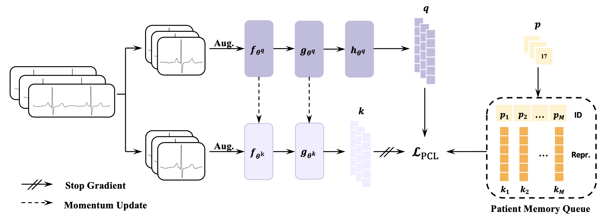

# Enhancing Contrastive Learning-based Electrocardiogram Pretrained Model with Patient Memory Queue

## Introduction

The official implementation of **PMQ**.



## Requirements

Run the following to prepare all required modules.

```zsh
conda create -n pmq_env python=3.10
conda activate pmq_env
pip install -r requirement.txt
```

## Datasets

### Download

- **MIMIC-IV-ECG**: Download the zip file from [the official site](https://physionet.org/content/mimic-iv-ecg/1.0/#files-panel) and extract the data.

- **PTB-XL**: Download the zip file from [the official site](https://physionet.org/content/ptb-xl/1.0.3/) and extract the data.

- **Chapman**: Download the *ECGDataDenoised.zip* and *Diagnostics.xlsx* files from [the official site](https://figshare.com/collections/ChapmanECG/4560497/1) and extract the data from the .zip file.

- **CPSC2018**: Download the zip file from [the official site](https://www.kaggle.com/datasets/bjoernjostein/china-12lead-ecg-challenge-database) and extract the data.

### Preprocessing

Run jupyter notebooks corresponding to each dataset from this [folder](./data_preprocessing) to preprocess the raw data, remember to modify the path in notebooks to load your downloaded dataset and to save processed dataset.

### Training data organization

All processed data should be organized as below(all notebooks produce the data in this format automatically):

```text
- [destination path specified in notebook]:
  - dataset name (e.g. ptbxl):
    - features:
      - feature_00001.npy
      ...
    - labels:
      - labels.npy
  - other dataset
  ...
```

The "destination path specified in notebook" will be used by all scripts to load data.

## Pre-training

To pre-train with the same setting as in the paper, just run:

```zsh
python train.py --root [folder containing all datasets]\
                --logdir [folder to save weights and training loss]\
                --schedule warmup\
                --neighbor\
                --use_id
```

If you want to try different settings, run the following for details:

```zsh
python train.py -h
```

## Fine-tuning

To fine-tune and test following our paper, run:

```zsh
python finetune.py --root [folder containing all datasets]\
                   --logdir [folder to save fine-tuned weights and logs]\
                   --pretrain [path of the pre-trained weight file]
```

To fine-tune with any amount of datasets and any combinations of fractions with other settings, run the following for details:

```zsh
python finetune.py -h
```
